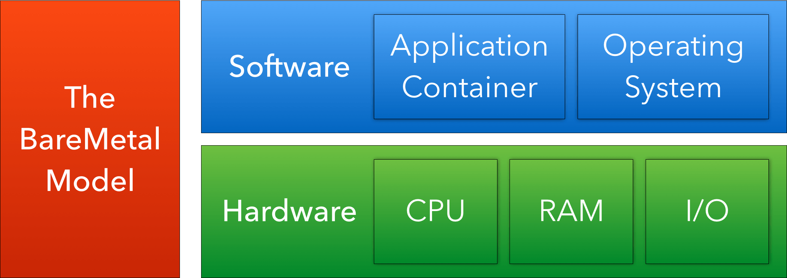

# BareNaked

_Just enough kernel_

Official repo of the BareNaked [exokernel](http://en.wikipedia.org/wiki/Exokernel). It's written from scratch in Assembly, designed for x86-64 hardware, with no dependencies except for the virtual/physical hardware.


## What is this?

BareNaked is a _very_ lean kernel. The name is a play on the phrase "bare metal" which means to run directly on physical or virtualized hardware. BareNaked also only offers the "bare essentials" required for a working operating system.

BareNaked provides basic support for symmetric multiprocessing, network, and disk access via a low-level abstraction layer.




### Key features
* **64-bit**: Make use of the extra-wide and additional registers available in 64-bit mode.
* **Mono-processing, multi-core**: The system is able to execute a single "program" but can spread the work load amongst available CPU cores.
* **Extremely tiny memory footprint**: A minimal bootable image, including boot-loader and operating system components, is currently 16K.
* **Physical and virtual hardware support** with full virtualization, using [x86 hardware virtualization](https://en.wikipedia.org/wiki/X86_virtualization) whenever available (it is on most modern x86-64 CPU's). In principle BareNaked should run on any x86-64 hardware platform, even on a physical x86-64 computer, given appropriate drivers. Officially, we develop on [QEMU](http://www.qemu.org) and [VirtualBox](https://www.virtualbox.org), which means that you can run BareNaked on both Linux, Microsoft Windows, and Apple macOS.


## Try it out!

```
# On unixy systems
./setup.sh
./make.sh

# On windows
# Cry
```


// EOF
